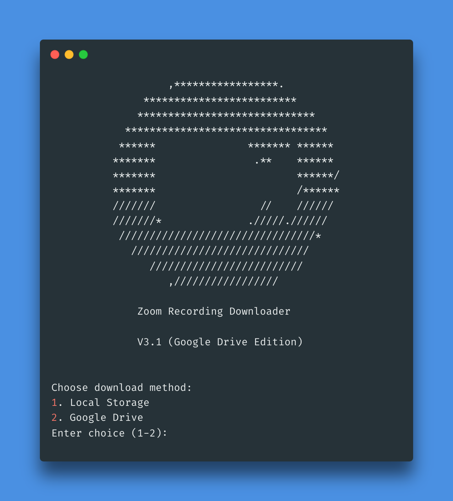

# zoom-recording-downloader

[](https://www.python.org/) [](https://raw.githubusercontent.com/ricardorodrigues-ca/zoom-recording-downloader/master/LICENSE)

**Zoom Recording Downloader** is a cross-platform Python script that uses Zoom's API (v2) to download and organize all cloud recordings from a Zoom account onto local storage.

## Screenshot ##


## Installation ##

_Attention: You will need [Python 3.6](https://www.python.org/downloads/) or greater_

```sh
$ git clone https://github.com/ricardorodrigues-ca/zoom-recording-downloader
$ cd zoom-recording-downloader
$ pip3 install -r requirements.txt
```

## Usage ##

_Attention: You will require a [Zoom Developer account](https://marketplace.zoom.us/) in order to create a [JWT app](https://marketplace.zoom.us/docs/guides/build/jwt-app) with your token_

Create a file called **appenv.py** with a variable called `JWT_TOKEN` that contains the JSON Web Token from your JWT app:

    JWT_TOKEN = 'your_token_goes_here'

Open the **zoom-recording-downloader.py** file using your editor of choice, and modify the following variables to reflect your environment:

- Set these variables to the earliest recording date you wish to download, within a six month period (default is January 1st, 2021)

      RECORDING_START_YEAR = 2021
      
      RECORDING_START_MONTH = 1
      
      RECORDING_START_DAY = 1

- Specify the folder name where the recordings will be downloaded (default = downloads)

      DOWNLOAD_DIRECTORY = 'downloads'

- Specify the name of the log file that will store the ID's of downloaded recordings (default = completed-downloads.log)

      COMPLETED_MEETING_IDS_LOG = 'completed-downloads.log'

Run command:

```sh
python3 zoom-recording-downloader.py
```
